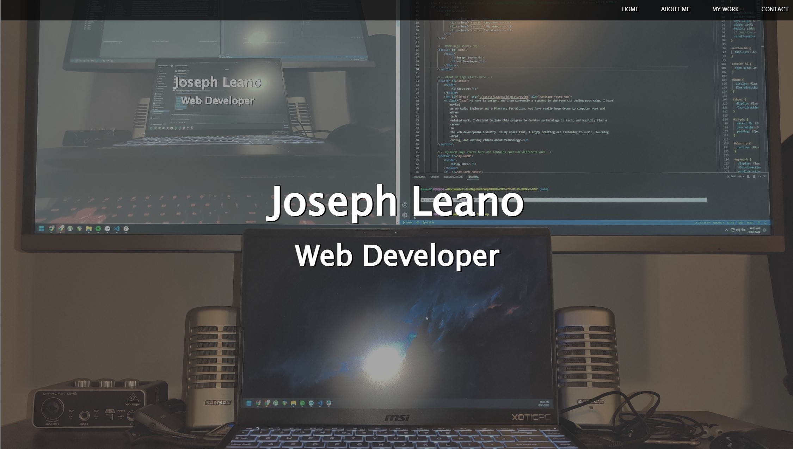

# Module 01 Challenge

## Mock Up



This is my completed code for the Module 02 challenge this week. We were given a task this week to make our own html and CSS code to create our own portfolio with sample work and other requirements. 

## User Story

```
AS AN employer
I WANT to view a potential employee's deployed portfolio of work samples
SO THAT I can review samples of their work and assess whether they're a good candidate for an open position
```

The Acceptance Criteria is as follows:

## Acceptance Criteria

```
GIVEN I need to sample a potential employee's previous work
WHEN I load their portfolio
THEN I am presented with the developer's name, a recent photo or avatar, and links to sections about them, their work, and how to contact them
WHEN I click one of the links in the navigation
THEN the UI scrolls to the corresponding section
WHEN I click on the link to the section about their work
THEN the UI scrolls to a section with titled images of the developer's applications
WHEN I am presented with the developer's first application
THEN that application's image should be larger in size than the others
WHEN I click on the images of the applications
THEN I am taken to that deployed application
WHEN I resize the page or view the site on various screens and devices
THEN I am presented with a responsive layout that adapts to my viewport
```

What I did to complete this challenge is take each individual criteria one at a time, while also trying to minimize repetativeness in the code. I first started creating my HTML file with element I knew I wanted in my portfolio (navigation, homepage, about me, my work, and a contact me section). This is also where I started linking certain elements to external site (like ```<a>``` elements to link to my various social media profiles, as well has `````` elemets in the My Work section to link to my Github profile as a placeholder, since I don't have any work to display at the moment)

Then I created a reset CSS and started working on my style CSS file to get a general idea of how I wanted the site to look. 

I then went to research on how to have the links scroll to their respective sections on the site. I was able to find a code that works for me and added/commented it on my CSS file.

I then went on to gather all my image files that I wanted to use and inserted them into my HTML and CSS code.

Once I was able to add images and get a general idea of how I wanted my portfolio to look, I went on to the more specific acceptance criteria. I made sure to make my site responsive to different screen layouts using ```display: flex``` in many of my CSS properties. I also made sure to resize the first application in my work to make it bigger than the other cards.


## Please see attached links to Repository and Deployed Page:

https://github.com/jdanleano/Mod-02-Challenge

https://jdanleano.github.io/Mod-02-Challenge/